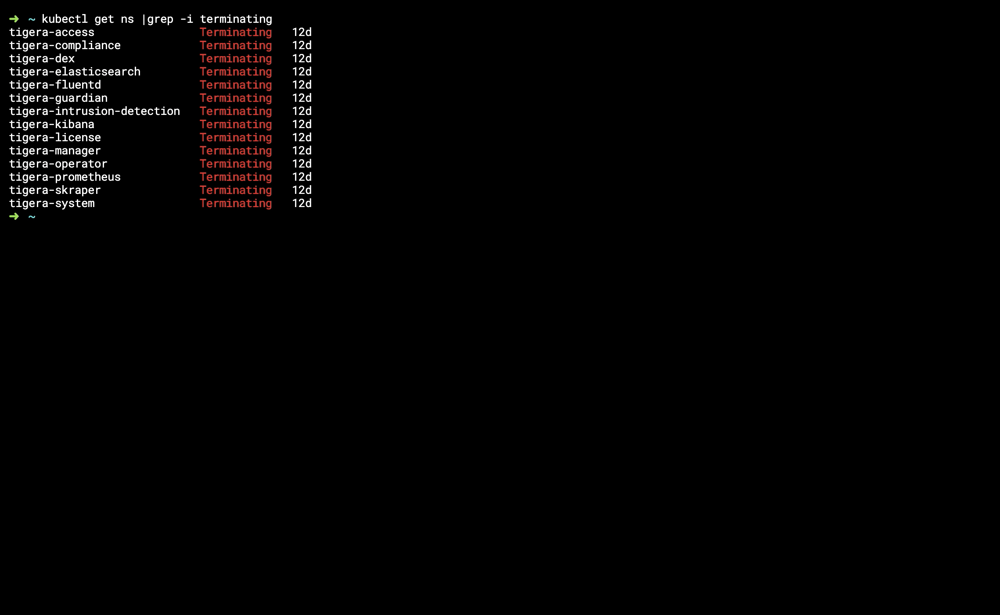

# Delete namespace which is stuck in the terminating state

### Check the namespace
```
kubectl get ns
```
then you will see the namespaces which are stuck in terminating state




### check the apiserver which are in fals state

```
kubectl get apiservice |grep -i False
```

```
kubectl describe apiservice {false-apiservice}
```

### delete the False api services

```
kubectl delete apiservice {false-apiservice}
```

### Below is the another way to delete those namespaces manually

1. check and list the namespace which are stuck in terminating state.

```
 kubectl get ns
```

2. describe the namespace which are stuck in terminating state.

```
kubectl describe ns {terminating namespace} -oyaml
```

3. export a temporary json file from terminating namespace.

```
kubectl get ns {terminating namespace} -oyaml > temp.json
```

4. Edit your tmp.json file. Remove the kubernetes value from the finalizers field and save the file.

Before removing the finalizers in the spec:
 ```
      "apiVersion": "v1",
      "kind": "Namespace",
      "metadata": {
          "creationTimestamp": "2018-11-19T18:48:30Z",
          "deletionTimestamp": "2018-11-19T18:59:36Z",
          "name": "<terminating-namespace>",
          "resourceVersion": "1385077",
          "selfLink": "/api/v1/namespaces/<terminating-namespace>",
          "uid": "b50c9ea4-ec2b-11e8-a0be-fa163eeb47a5"
      },
      "spec": {
         "finalizers":
      },
      "status": {
          "phase": "Terminating"
      }
```

After removeing the finalizers in the spec:

```
   "kind": "Namespace",
   "apiVersion": "v1",
   "metadata": {
     "name": "<terminating-namespace>",
     "selfLink": "/api/v1/namespaces/<terminating-namespace>/finalize",
     "uid": "b50c9ea4-ec2b-11e8-a0be-fa163eeb47a5",
     "resourceVersion": "1602981",
     "creationTimestamp": "2018-11-19T18:48:30Z",
     "deletionTimestamp": "2018-11-19T18:59:36Z"
   },
   "spec": {

   },
   "status": {
     "phase": "Terminating"
   }
```

5. To set a temporary proxy IP and port, run the following command in your kubernetes master node. Be sure to keep your terminal window open until you delete the stuck namespace.

```
 kubectl proxy
```
6. From a new terminal window, make an API call with your temporary proxy IP and port.

```
 curl -k -H "Content-Type: application/json" -X PUT --data-binary @tmp.json http://127.0.0.1:8001/api/v1/namespaces/{terminating-namespace}/finalize
```

7. Verify that the terminating namespace is removed.

```
kubectl get ns
```

[Click here for Refurl](https://www.ibm.com/docs/en/cloud-private/3.2.x?topic=console-namespace-is-stuck-in-terminating-state)

